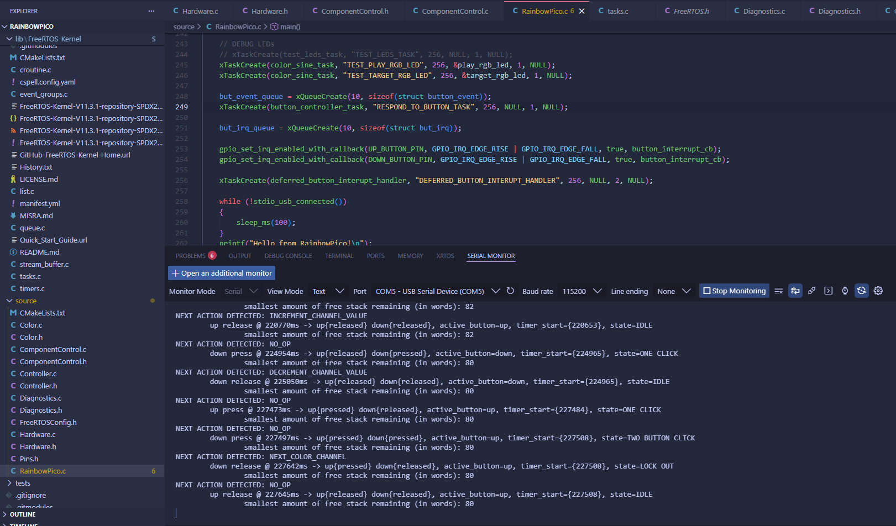

# RainbowPico

Building a color hue-matching game on an RP2040 with a starter kit limited to two buttons, two RGB LEDs, and some one-color LEDs. 

**Diagram**
```ASCII
┌────────────────────────────────────────────────────────────────────┐
│ PICO                                                               │
│                                                                    │
│phys:  04   05   06   09   10   11   19   20   25   26   27   36  38│
│GPIO: GP02 GP03 GP04 GP06 GP07 GP08 GP14 GP15 GP19 GP20 GP21 3V3 GND│
└───────│────│────│────│────│────│────│────│────│────│────│────│───│─┘
        │    │    │    │    │    │    │    │    │    │    │    │   │  
        │    │    │ ┌──┴─┐┌─┴──┐┌┴───┐│    │ ┌──┴─┐┌─┴──┐┌┴───┐│   │  
        │    │    │ │220Ω││220Ω││220Ω││    │ │220Ω││220Ω││220Ω││   │  
        │    │    │ └──┬─┘└─┬──┘└┬───┘│    │ └──┬─┘└─┬──┘└┬───┘│   │  
      ┌─┼─┐┌─┼─┐┌─┼─┐ ┌┴────┴────┴┐   │    │   ┌┴────┴────┴┐   │   │  
      │RED││GRE││BLU│ │B    G    R│   │    │   │B    G    R│   │   │  
      │LED││LED││LED│ │Target LED │   │    │   │ Play LED  │   │   │  
      └───┘└───┘└───┘ └─────┬─────┘   │    │   └─────┬─────┘   │   │  
        │    │    │         │      ┌──┼─┐ ┌┼───┐     │         │   │  
        └────┼────┘         │      │Up  │ │Down│     │         │   │  
             │              │      │But.│ │But.│     │         │   │  
          ┌──┼─┐            │      └──┬─┘ └┬───┘     │         │   │  
          │220Ω│            │         │    │         │         │   │  
          └──┬─┘            └─────────│────│─────────┴─────────┘   │  
             │                        │    │                       │  
             │                        │    │                       │  
             └────────────────────────┴────┴───────────────────────┘  
```
## Highlights:
- Debouncing signals
- Optimizing repeated expensive math functions into a pre-computed lookup table. 
- Brought FreeRTOS into a PICO project.
- Implemented tasks, abstracting concurency.
- Implemented an ISR for button signal detection and and an ISR-handler to help transition the raw signal into application code using ISR-safe function values, and priorities.
- Implemented a finite state machine abstracting the various possible two-button gestures into a set of controller actions ready to implemented as functions for updating outgoing signals to the LEDs.
- Learned a lot of C: bitmasks, look-up tables for simplifying branch logic that differs only in value, asserts, among other things.
- Agentically set up a testing environment for verifying the state machine in repeatable, informative way on the host instead of being forced to experiment with the hardware manually.

See `PROGRAMMER.md` for development journal. Most implementation was done LLM-free but LLMs did inform the work. Commits with heavy LLM code are tagged with LLM co-authors. 

## Other
**Screenshot of diagnostics after implementing a state machine for the controller printing to serial USB:**

 

## (old version) Demo
https://www.youtube.com/watch?v=C_VW9YH5voE
